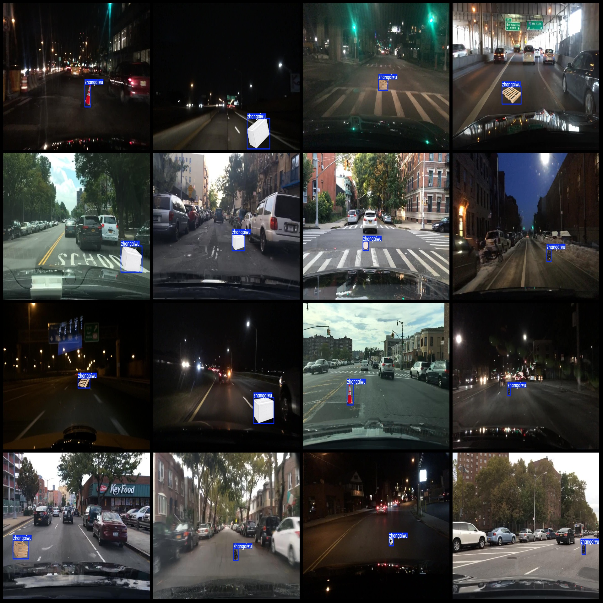
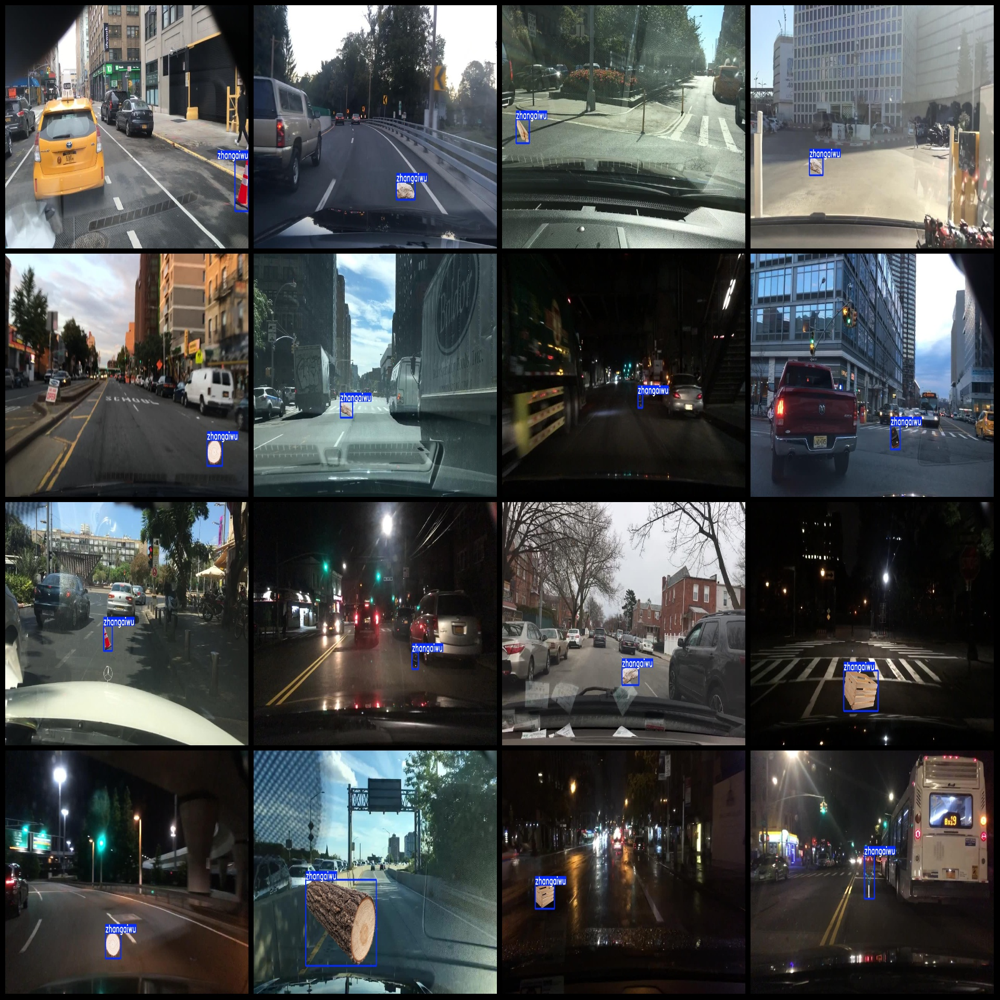

# Smart Traffic Vehicle Occupancy and Spillage Identification Dataset - 7323 Instances in 1-class Simulated Synthetic Version

Note: The obstacles in this dataset are affixed to the background images. For details, please refer to the images.
Dataset format: Pascal VOC format + YOLO format (txt files without split paths, containing only jpg images along with corresponding VOC format xml files and YOLO format txt files)
Number of images (jpg file count): 7323
Number of annotations (xml file count): 7323
Number of annotations (txt file count): 7323
Number of annotation categories: 1
Annotation category name: ["zhangaiwu"]
Number of bounding boxes for each category:
zhangaiwu = 7343
Total bounding boxes = 7343
Number of images each category occupies:
zhangaiwu = 7323
Image resolution: 1280x720
Annotation tool used: labelImg
Annotation rules: drawing bounding boxes for each class
Important note: The dataset does not have been divided into training, validation, or test sets; you must divide it yourself.
Special declaration: This dataset does not guarantee the accuracy of models trained on it or any weights files.
Image preview:
Annotation example:

## Image

Here is a pay link on Stripe ( https://buy.stripe.com/3cs8yP7sY87d0vu9AB ). Please contact me lonlonago@foxmail.com after funding $89, and I will send you a complete data files , thank you!

